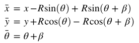

# Localization-Kalman-Filter
robot localization by kalman filter  
18.7 ZhangYu,autobrain

## multi-sensor fusion localization：
1. GPS  
2. IMU: motion model/kalman filter predict  
    - α: wheel turn angle=steer wheel turn angle/k
    - turn angle: β=distance/wheelbase*tan(α) （rad）  
    - turn radius: R=d/β=w/tan(α) （km）  
  
3. range system: lidar  

## how to use?
### by pycharm：
1. open pycharm, check out from version control/git, enter **URL**
2. set local or virtual/conda environment/**interpreter**
    - python and java are both compile and interpret languages, like jvm and virtualenv
    - local: pip(vs use it)
    - virtual: virtualenv(inherit from local python), conda, pipenv
        - virtualenv: belong to each project, categories/all projects can use
        - conda: divide to several categories
3. inherit from local lib, alt+enter install package
### by git
1. clone, init
2. code
3. add, commit, status
4. remote
5. *branch, merge
6. push, pull

## reference：
https://github.com/rlabbe/Kalman-and-Bayesian-Filters-in-Python 
https://github.com/ApolloAuto/apollo  
https://github.com/OctopusNO1/UdaProject-Extended-Kalman-Filter

